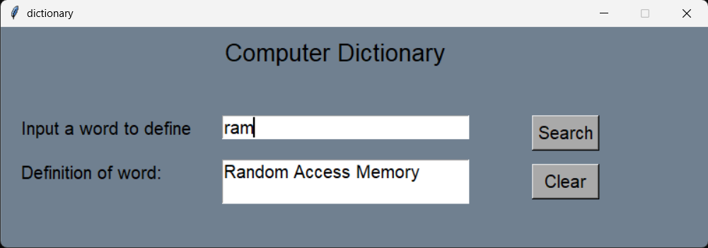

# 📖 Python Tkinter Computer Dictionary

A lightweight, interactive desktop dictionary built with Python and Tkinter. This application allows users to look up common computer science acronyms and terminology instantly.

### 📸 Application Interface


### ✨ Features
* **Instant Lookup:** Uses Python dictionary data structures for fast retrieval of computer terms (e.g., CPU, RAM, GUI, API).
* **Keyboard Shortcuts:** Built for speed with key bindings:
  * Press **`Enter`** to search.
  * Press **`Escape`** to clear the fields.
* **Error Handling:** Includes graceful error messages ("Sorry! This word is not in my Dictionary") if a user searches for an undocumented term.
* **Custom Layout:** Utilizes the Tkinter `.place()` geometry manager for precise, absolute coordinate positioning of all widgets.

### 🛠️ Built With
* **Python 3**
* **Tkinter**

### 🚀 How to Run
Since this application uses standard Python libraries, there is no need to install external packages.

1. Clone or download this repository to your local machine.
2. Open your terminal or command prompt.
3. Run the application:
   ```bash
   python Computer_Dictionary.py
